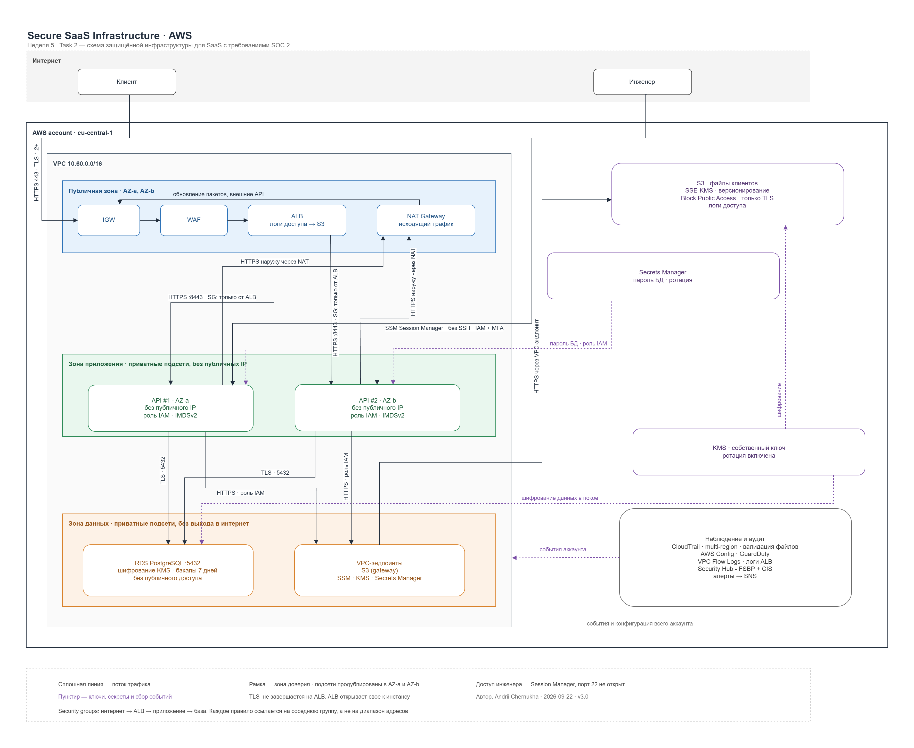

# Secure SaaS Infrastructure

Инфраструктура для SaaS-платформы, работающей с чувствительными данными
клиентов, с прицелом на требования SOC 2. Описана кодом (Terraform),
развёрнута в AWS, регион `eu-central-1`.



## Зоны доверия

| Зона | Что внутри | Кто может обращаться |
|---|---|---|
| Интернет | клиенты, инженеры | — |
| Публичная | балансировщик, NAT-шлюз, WAF (под переключателем) | интернет по 443 |
| Приложение | API в приватных подсетях, без публичных адресов | только балансировщик, по TLS на 8443 |
| Данные | PostgreSQL, файловое хранилище | только зона приложения |
| Управление | доступ инженеров, журналы, ключи | только по IAM |

Граница между зонами — не рисунок, а правила групп безопасности, которые
ссылаются друг на друга, и таблицы маршрутизации. У зоны данных маршрута в
интернет нет вообще.

## Что развёрнуто

78 ресурсов в базовой конфигурации, 97 с включёнными Config и Security Hub. Основное:

| Компонент | Назначение | Ключевое в настройке |
|---|---|---|
| VPC `10.60.0.0/16`, 6 подсетей в двух зонах доступности | сеть | три группы подсетей по зонам доверия |
| Application Load Balancer | единственный вход снаружи | журналы доступа в S3, отбрасывание некорректных заголовков, к инстансам обращается по HTTPS |
| 2 × EC2 `t3.micro`, Amazon Linux 2023 | приложение | IMDSv2 обязателен, публичных адресов нет, диски зашифрованы, принимают только TLS |
| RDS PostgreSQL 18.3, `db.t4g.micro` | база | шифрование, копии 7 дней, пароль в Secrets Manager, вход по токену IAM |
| 2 бакета S3 | файлы клиентов и журналы | публичный доступ закрыт, версии, доступ только по TLS |
| Ключ KMS | шифрование всего перечисленного | ротация раз в год, политика написана вручную |
| CloudTrail, VPC Flow Logs, журналы ALB | аудит | мультирегион, проверка подписи файлов, копия в CloudWatch Logs |
| 5 правил EventBridge → SNS | оповещения | вход под root, правка групп безопасности, остановка журнала, создание пользователя IAM, находка Security Hub уровня CRITICAL или HIGH |
| NAT-шлюз, шлюзовой эндпоинт S3 | выход наружу | один шлюз на VPC, обращения к S3 не выходят в интернет |
| AWS Config, Security Hub | непрерывная проверка соответствия | запись 25 типов ресурсов, наборы контролей FSBP и CIS v3.0.0 |

Выключены по умолчанию и включаются переменными: WAF, GuardDuty, AWS Config,
Security Hub, интерфейсные VPC-эндпоинты, реплика базы во второй зоне. Причина —
постоянная оплата; состояние переключателей видно в выводе `enabled_guardrails`.

## Документация

| Документ | О чём |
|---|---|
| [docs/architecture.md](docs/architecture.md) | почему инфраструктура устроена так: зоны доверия, потоки, девять принятых решений |
| [docs/security-controls.md](docs/security-controls.md) | таблицы «контроль → ресурс в коде → чем доказывается», с командами проверки |
| [docs/challenges.md](docs/challenges.md) | что пошло не так и чем закончилось: семь разборов |
| [compliance/README.md](compliance/README.md) | непрерывная проверка соответствия: AWS Config, Security Hub, разбор находок |

## Как запустить

Нужны Terraform 1.10 или новее, учётные данные AWS с правами на создание
перечисленного выше и бакет S3 для хранения состояния — его имя задано в
[terraform/providers.tf](terraform/providers.tf).

```bash
cd terraform && cp terraform.tfvars.example terraform.tfvars
```

В `terraform.tfvars` стоит задать `alerts_email` — иначе тема оповещений
создастся без подписки. Файл в `.gitignore` и в репозиторий не попадает.

```bash
terraform init && terraform plan
```

```bash
terraform apply
```

Развёртывание занимает около пятнадцати минут, дольше всего создаётся база.
После `apply` на почту придёт письмо от AWS с подтверждением подписки —
пока ссылка в нём не открыта, оповещения не доставляются.

## Проверка после развёртывания

Приложение отвечает:

```bash
curl -s -o /dev/null -w '%{http_code}\n' "http://$(terraform output -raw alb_dns_name)"
```

Журнал аудита пишется в оба назначения, ошибок доставки нет:

```bash
aws cloudtrail get-trail-status --name secure-saas-dev-trail --query '{logging:IsLogging,s3Error:LatestDeliveryError,cwError:LatestCloudWatchLogsDeliveryError}'
```

База недоступна снаружи — проверка отказом:

```bash
timeout 8 bash -c "cat < /dev/null > /dev/tcp/$(terraform output -raw db_endpoint | cut -d: -f1)/5432" && echo открыто || echo закрыто
```

Остальные проверки, включая обращение к хранилищу по незащищённому каналу,
собраны в [docs/security-controls.md](docs/security-controls.md).

## Проверка соответствия

Проверок две, и они смотрят на разное.

**До развёртывания — код.** Каждый push и pull request проходит
[проверку](.github/workflows/iac-scan.yml): форматирование, `terraform validate`
и сканер `trivy config` с порогом HIGH и CRITICAL. Срабатывания не заглушаются:
они либо исправляются, либо записываются в [docs/challenges.md](docs/challenges.md)
с объяснением, почему остаются. На момент последней проверки из семи срабатываний
три исправлены кодом, четыре приняты осознанно.

**После развёртывания — аккаунт.** AWS Config записывает конфигурацию ресурсов,
Security Hub сверяет её с двумя наборами контролей — AWS Foundational Security
Best Practices и CIS AWS Foundations Benchmark — и выставляет оценку. Новая
находка уровня CRITICAL или HIGH приходит письмом через EventBridge и SNS.

Сканер кода не знает, что получилось в аккаунте, а Security Hub видит то, чего
в коде нет вовсе: настройки самого аккаунта, чужие ресурсы, забытые эксперименты.
Одна проверка предотвращает, вторая обнаруживает; они не заменяют друг друга.

Замеры «до» и «после», разбор находок и принятые риски —
в [compliance/README.md](compliance/README.md).

## Что осталось незакрытым

| Пробел | Почему так | Что было бы в production |
|---|---|---|
| Трафик **от клиента до балансировщика** идёт по HTTP | у учебного проекта нет домена, без домена не выдать сертификат ACM | домен в Route 53, сертификат ACM, слушатель HTTPS с TLS 1.2+, порт 80 только для редиректа. Участок от балансировщика до инстансов зашифрован уже сейчас |
| WAF и GuardDuty выключены | постоянная оплата, кредиты аккаунта ограничены | работают постоянно, находки GuardDuty уходят в тот же SNS |
| Config и Security Hub включаются на время проверки | оплата за каждый записанный элемент конфигурации и за каждую проверку контроля | работают непрерывно — в этом и смысл непрерывного соответствия |
| База в одной зоне доступности | Multi-AZ удваивает стоимость | синхронная реплика во второй зоне, `db_multi_az = true` |
| Защита базы от удаления выключена | стенд многократно поднимается и сносится | `db_deletion_protection = true`, финальный снимок при удалении |
| Приложения нет — на инстансах заглушка | задание про инфраструктуру, не про приложение | код разворачивается через CI, инстансы в группе автомасштабирования |
| Инстансы созданы поимённо, без группы автомасштабирования | так нагляднее видно каждый контроль в коде | Auto Scaling Group с шаблоном запуска и заменой по проверке состояния |
| Терраформ запускается с ноутбука пользователем IAM | учебный аккаунт, роли для CI не заведены | OIDC-роль для GitHub Actions, ключей доступа в аккаунте нет вообще |

## Стоимость

Развёрнутый стенд обходится примерно в три доллара в сутки: NAT-шлюз,
балансировщик, два инстанса, база с диском. Config и Security Hub добавляют
к этому плату за каждый записанный элемент конфигурации и за каждую проверку
контроля — на стенде такого размера это единицы долларов. Поэтому стенд живёт
не постоянно: поднимается, проверяется, снимается.

```bash
terraform destroy
```
