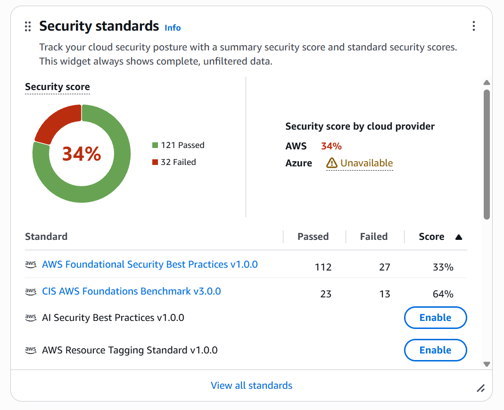

# Непрерывная проверка соответствия: AWS Config и Security Hub

Вместо разовой проверки перед аудитом инфраструктура проверяется постоянно:
AWS Config записывает конфигурацию ресурсов, Security Hub сверяет её с наборами
контролей и выставляет оценку. Находка уровня CRITICAL или HIGH приходит письмом.

## Что включено

| Что | Как | Где в коде |
|---|---|---|
| AWS Config | запись 25 типов ресурсов, из которых состоит эта инфраструктура | [monitoring.tf](../terraform/monitoring.tf) |
| Правила Config | 8 управляемых правил: шифрование, публичный доступ, порты управления | [monitoring.tf](../terraform/monitoring.tf) |
| Security Hub | AWS Foundational Security Best Practices v1.0.0 и CIS AWS Foundations Benchmark v3.0.0 | [security-hub.tf](../terraform/security-hub.tf) |
| GuardDuty, Inspector | обнаружение угроз и уязвимостей | [monitoring.tf](../terraform/monitoring.tf) |
| Оповещения | Security Hub → EventBridge → SNS, только CRITICAL и HIGH в состоянии NEW | [security-hub.tf](../terraform/security-hub.tf) |

Все перечисленные сервисы выключены по умолчанию и включаются переменными:
они тарифицируются за объём работы, а не за время.

## Результат

| Замер | Проваленных контролей | CRITICAL | HIGH | MEDIUM | LOW |
|---|---|---|---|---|---|
| **До исправлений** | 40 | 4 | 6 | 22 | 8 |
| **После исправлений** | 33 | 3 | 3 | 19 | 8 |

### Счёт соответствия

| Набор контролей | Пройдено | Провалено | Счёт |
|---|---|---|---|
| AWS Foundational Security Best Practices v1.0.0 | 112 | 27 | 33% |
| CIS AWS Foundations Benchmark v3.0.0 | 23 | 13 | 64% |
| **Общий счёт** | **121** | **32** | **34%** |

**Низкий процент здесь не означает «инфраструктура защищена на треть».**
Security Hub делит пройденные контроли на **все** включённые в наборе, а не на
сумму пройденных и проваленных. В FSBP больше трёхсот контролей, и основная
их часть относится к сервисам, которых в проекте нет вовсе: ECS, EKS, Lambda,
API Gateway, DynamoDB. Такой контроль не проходит просто потому, что проверять
нечего.

Видно это по разнице между наборами: у CIS, где контролей около сорока и почти
все применимы, счёт 64% и совпадает с долей пройденных. У FSBP при 112
пройденных и 27 проваленных счёт 33% — разница целиком в контролях без данных.

Поэтому основной метрикой этой работы взято **число проваленных контролей**:
40 до исправлений, 33 после. Оно сравнимо между замерами и не зависит от того,
сколько в наборе проверок для чужих сервисов.



Исходные данные обоих замеров лежат рядом: [snapshots/before.json](snapshots/before.json)
и [snapshots/after.json](snapshots/after.json).

Счёт за исходное состояние не зафиксирован: Security Hub считает его
асинхронно и предупреждает, что результат появляется в пределах получаса после
запроса, а на момент первого замера он ещё не был посчитан.

**Закрыто 15 контролей, появилось 8.** Разница в семь, а не в пятнадцать, и это
не ошибка подсчёта — объяснение ниже, в разделе «Исправление порождает находки».

**На ресурсах проекта не осталось ни одного контроля уровня HIGH.** Три
оставшихся относятся к машине, запущенной в аккаунте под другой учебный курс,
и к сети по умолчанию, которой проект не пользуется.

## Исправлено кодом

Каждое исправление — в Terraform, не кликом в консоли: код остаётся источником
истины, и через год будет видно не только что настроено, но и почему.

| Контроль | Уровень | Чем исправлено | Коммит |
|---|---|---|---|
| `SSM.7` | CRITICAL | запрет публикации документов Systems Manager на уровне аккаунта | [ca4a48c](https://github.com/actimel33/secure-saas-infra/commit/ca4a48c) |
| `GuardDuty.1` | HIGH | включён GuardDuty | [ca4a48c](https://github.com/actimel33/secure-saas-infra/commit/ca4a48c) |
| `IAM.28` | HIGH | включён внешний анализатор доступа IAM Access Analyzer | [ca4a48c](https://github.com/actimel33/secure-saas-infra/commit/ca4a48c) |
| `Inspector.1` … `Inspector.4` | HIGH | включён Inspector для инстансов, образов и функций | [ca4a48c](https://github.com/actimel33/secure-saas-infra/commit/ca4a48c) |
| `S3.1` | MEDIUM | блокировка публичного доступа на уровне аккаунта | [ca4a48c](https://github.com/actimel33/secure-saas-infra/commit/ca4a48c) |
| `EC2.7` | MEDIUM | шифрование дисков EBS по умолчанию | [ca4a48c](https://github.com/actimel33/secure-saas-infra/commit/ca4a48c) |
| `IAM.7`, `IAM.15`, `IAM.16` | MEDIUM, LOW | парольная политика: 14 символов, все классы, запрет повтора | [ca4a48c](https://github.com/actimel33/secure-saas-infra/commit/ca4a48c) |
| `GuardDuty.7`, `GuardDuty.11` | HIGH | включён Runtime Monitoring | [86d6f10](https://github.com/actimel33/secure-saas-infra/commit/86d6f10) |
| `GuardDuty.12`, `GuardDuty.13` | MEDIUM | то же, для ECS и EC2 | [86d6f10](https://github.com/actimel33/secure-saas-infra/commit/86d6f10) |

Ещё три контроля — `CloudTrail.2`, `CloudTrail.4`, `CloudTrail.5` — закрылись
удалением постороннего журнала `codepipeline-source-trail`. Он остался от
экспериментов с CodePipeline, писал в бакет, которого больше нет, и ни одного
пайплайна в аккаунте не существует. Удалён вручную: ресурс был создан вне
этого кода, добавлять его в Terraform ради удаления бессмысленно.

## Исправление порождает находки

Контролей закрыто пятнадцать, а разница в итоге семь. Восемь находок появились
уже после исправлений, и половина — прямое следствие самих исправлений.

Включение GuardDuty добавило четыре новых контроля: `GuardDuty.7`, `11`, `12`,
`13`. Все они проверяют настройку самого GuardDuty — пока сервиса в аккаунте не
было, проверять было нечего. Их пришлось закрывать вторым заходом, включив
Runtime Monitoring.

Это не недосмотр и не особенность AWS. Любой добавленный контроль приносит с
собой собственные требования к настройке, и в непрерывной проверке соответствия
это нормальный режим работы, а не разовая зачистка: закрыли одно — появилось
другое. Ровная картина «было сорок, стало двадцать пять» выглядела бы
аккуратнее, но описывала бы процесс неправильно.

Остальные четыре новые находки — от машины с Kali Linux, запущенной в аккаунте
под другой курс, и от сети по умолчанию, в которой она работает.

## Подавлено с обоснованием

| Контроль | Уровень | Почему подавлено |
|---|---|---|
| `KMS.3` | CRITICAL | Ключ предыдущего развёртывания, отправленный в очередь на удаление командой `terraform destroy`. Данных, зашифрованных им, не существует — их удалила та же команда. Отменить удаление можно, но тогда в аккаунте останется оплачиваемый ключ без назначения. Сократить ожидание нельзя: семь дней — минимальное окно, которое допускает KMS |

Подавление — не «закрыть глаза»: находка остаётся в истории вместе с текстом
обоснования, и аудитор видит принятое решение, а не пустое место.

## Принято как задокументированный риск

| Контроль | Уровень | Почему остаётся | Чем компенсируется |
|---|---|---|---|
| `Config.1` | CRITICAL | контроль засчитывается только при записи **всех** типов ресурсов и работе через service-linked роль. Задание прямо требует обратного — «do not enable recording of all resource types» — потому что Config берёт плату за каждый записанный элемент. Выполнить оба требования одновременно невозможно | записываются 25 типов, из которых состоит инфраструктура; список в коде и читается за минуту |
| `IAM.6` | CRITICAL | требует **аппаратного** MFA на root-пользователе. Виртуальный MFA включён — это видно по тому, что `IAM.9` в находках нет | root не используется в работе, вход под ним отслеживается правилом EventBridge с оповещением на почту |
| `RDS.5` | MEDIUM | реплика во второй зоне удваивает стоимость базы | переменная `db_multi_az`, группа подсетей уже охватывает две зоны |
| `ELB.1` | MEDIUM | редирект HTTP→HTTPS требует сертификата, сертификат — домена, которого у проекта нет | переменная `certificate_arn`; участок от балансировщика до инстансов зашифрован уже сейчас |
| `ELB.6`, `RDS.8` | MEDIUM, LOW | защита от удаления не даёт отработать `terraform destroy`, а стенд поднимается и сносится многократно | переменные `db_deletion_protection`; для production значение `true` |
| `EC2.10`, `EC2.55` … `EC2.60` | MEDIUM | интерфейсные VPC-эндпоинты тарифицируются за каждый час существования каждого эндпоинта | переменная `enable_interface_endpoints`; обращения к сервисам идут через NAT, наружу трафик не выходит без шифрования |
| `Macie.1` | MEDIUM | сервис классификации данных платный и рассчитан на постоянную работу | файлы клиентов шифруются собственным ключом, доступ к бакету только по TLS и только роли приложения |
| `S3.22`, `S3.23` | MEDIUM | журналирование операций с объектами включено только для бакета с файлами клиентов: события данных платные и многочисленные | остальные бакеты содержат журналы и состояние, а не данные клиентов |
| `Account.1` | MEDIUM | контакт безопасности создаётся, только если его значения заданы в локальном `terraform.tfvars` | почте и телефону не место в публичном репозитории; код готов, значения задаются при развёртывании |
| `SSM.6`, `IAM.18`, `RDS.6`, `RDS.23` | LOW | относятся к сценариям, которых в проекте нет: автоматизация SSM, роль поддержки, расширенный мониторинг базы, нестандартный порт | — |

## Находки на ресурсах вне проекта

Security Hub проверяет весь аккаунт, а не только то, что описано этим кодом.

| Контроль | Уровень | Ресурс |
|---|---|---|
| `EC2.8`, `EC2.9` | HIGH | инстанс с Kali Linux, запущенный под другой учебный курс. У него нет роли IAM, доступ по SSH ограничен одним адресом |
| `EC2.2`, `EC2.15`, `EC2.6` | HIGH, MEDIUM | сеть по умолчанию `172.31.0.0/16`: группа безопасности с правилами, подсети с автоматическим публичным адресом, отсутствие flow logs. Проект ею не пользуется |
| `S3.5`, `S3.9`, `S3.13`, `S3.20` | MEDIUM, LOW | бакет `itsyndicate-tfstate-andrew` с состоянием Terraform. Создан до этого проекта и вне его: бакет состояния не может управляться тем же состоянием, которое в нём лежит |
| `IAM.2`, `CloudTrail.7` | LOW | пользователь, под которым запускается Terraform, и журналирование обращений к бакету с журналами |

Группа безопасности сети по умолчанию, принадлежащая **нашей** VPC, очищена
кодом — ресурс `aws_default_security_group` забирает её под управление и
оставляет без единого правила.

## Чего эти проверки не покажут

Автоматические проверки видят конфигурацию, но не видят процесс. Из критериев
SOC 2 они не подтвердят ничего из следующего: что доступы сотрудников
пересматриваются, что инциденты разбираются и закрываются, что сотрудники
проходят обучение, что у подрядчиков подписаны соглашения, что резервные копии
действительно восстанавливаются, а не просто создаются.

Отдельно: проверки сработали **после** развёртывания. Сканер кода в CI ловит
часть тех же ошибок до него, и это разные инструменты, а не дублирование —
предотвращение дешевле обнаружения.

## Стоимость

| Сервис | За что берут |
|---|---|
| AWS Config | за каждый записанный элемент конфигурации и за каждую оценку правила |
| Security Hub | за каждую проверку контроля |
| GuardDuty | за объём обработанных журналов; Runtime Monitoring — за vCPU-часы |
| Inspector | за просканированный ресурс |

На стенде такого размера это единицы долларов в сутки — заметно меньше, чем
сама инфраструктура. Но модель оплаты принципиально иная: не за время работы, а
за объём проверенного. Поэтому запись Config сужена до нужных типов ресурсов,
а не включена целиком.

После сдачи все четыре сервиса выключаются:

```
enable_config = false
enable_security_hub = false
enable_guardduty = false
enable_inspector = false
```

затем `terraform apply`.
